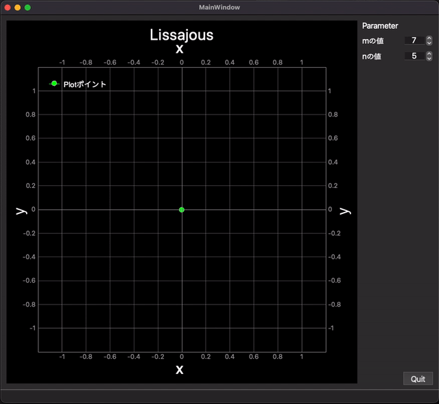

# これは何？

PyQtGraphでグラフを描く際の凡例の追加に関するメモです。
動作イメージは、以下のとおりです。

## 環境

当方の環境は以下のとおりです。

- HW
  - MacBook Pro (13-inch, 2019, Four Thunderbolt 3 ports)
  - macOS Monterey 12.5.1（21G83）
  - 2.8 GHz クアッドコアIntel Core i7
- SW
  - Python 3.10.4
  - PySide6 6.3.2
  - pyqtgraph 0.13.1

2880x1800のdot by dotにて使用しているため、他の解像度の環境ではフォントの表示が大きくなりすぎることもあろうかと思います。
あらかじめ、ご承知ください。
